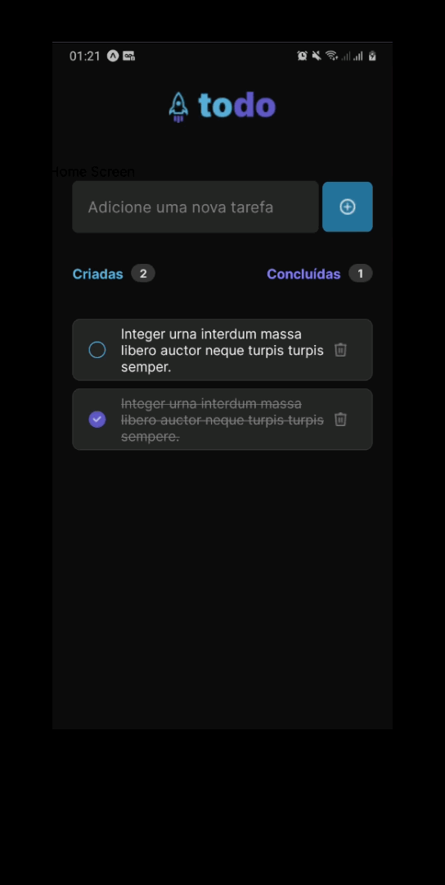

## Desafio proposto na Trilha React Native 2023 - Rocketseat
---

  
  

  
**Resumo do Desafio:**
 
Nesse desafio, você vai desenvolver uma aplicação de controle de tarefas no estilo **to-do list**, que contém as seguintes funcionalidades:

- [x] Adicionar uma nova tarefa
- [x] Marcar e desmarcar uma tarefa como concluída
- [x] Remover uma tarefa da listagem
- [x] Mostrar o progresso de conclusão das tarefas

Apesar de serem poucas funcionalidades, você vai precisar relembrar conceitos como:

- Estados
- Imutabilidade do estado
- Listas e chaves no React Native
- Propriedades
- Componentização

> Link para instruções mais detalhadas: [Desafio 01 - Instruções](https://efficient-sloth-d85.notion.site/Desafio-01-Praticando-os-conceitos-do-React-Native-f8f164e29df74cd987e1f9aebf142ffb)
